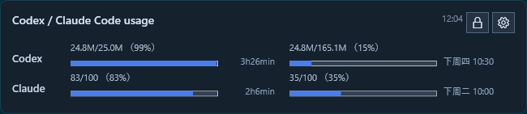

# CodeQuotaWidget

Windows desktop widget for Codex and Claude Code usage.



## Features

- Compact desktop overlay for Codex and Claude Code limits.
- Lock/unlock dragging with a lock icon.
- Opacity setting.
- Startup install/uninstall scripts.
- Codex current and weekly usage from local Codex session logs.
- Claude usage from the official Claude OAuth usage endpoint.
- Gemini App usage through an experimental background browser-session reader.
- Chinese weekly reset labels such as `周四 15:30` and `下周二 10:00`.

## Run

```powershell
powershell -NoProfile -ExecutionPolicy Bypass -File .\Run-UsageWidget.ps1
```

## Autostart

```powershell
powershell -NoProfile -ExecutionPolicy Bypass -File .\Install-Autostart.ps1
```

To remove autostart:

```powershell
powershell -NoProfile -ExecutionPolicy Bypass -File .\Uninstall-Autostart.ps1
```

## Security

- No real Claude, Codex, or GitHub tokens are committed.
- `config.json` is ignored because it stores local widget position and opacity.
- The widget reads `%USERPROFILE%\.claude\.credentials.json` at runtime to call Claude's official usage endpoint, but token values are only used locally.
- The hard-coded Claude OAuth client id is a public application identifier, not a secret.
- Gemini App support uses a local `gemini-browser-profile/` browser profile. This folder is ignored by git because it can contain Google login state.
- Normal Gemini refreshes run headless; the visible browser is opened only from the `Gemini` login button.
